# BEAVR
A **B**rowser-based tool for the **E**xploration **A**nd **V**isualization of **R**NAseq data 

BEAVR is a graphical tool to automate analysis and exploration of small and large RNAseq datasets using DESeq2.

---

# Table of contents

+ [Installation & Requirements](https://github.com/developerpiru/BEAVR#installation--requirements)
	+ [Use the Docker container](https://github.com/developerpiru/BEAVR#Use-the-Docker-container)
		+ [Docker on Windows](https://github.com/developerpiru/BEAVR#docker-on-windows)
		+ [Docker on Mac OS](https://github.com/developerpiru/BEAVR#docker-on-mac-os)
		+ [Docker on Linux (Ubuntu)](https://github.com/developerpiru/BEAVR#docker-on-linux-ubuntu)
	+ [Setup a new R environment with the automated installer](https://github.com/developerpiru/BEAVR#Setup-a-new-R-environment-with-the-automated-installer)
		+ [A new R environment in Windows](https://github.com/developerpiru/BEAVR#a-new-r-environment-in-windows)
		+ [A new R environment in Mac OS](https://github.com/developerpiru/BEAVR#a-new-r-environment-in-mac-os)
		+ [A new R environment in Linux](https://github.com/developerpiru/BEAVR#a-new-r-environment-in-linux)
	+ [Run in your existing R installation](https://github.com/developerpiru/BEAVR#Run-in-your-existing-R-installation)
		+ [Use your existing R installation in Windows](https://github.com/developerpiru/BEAVR#use-your-existing-r-installation-in-windows)
		+ [Use your existing R installation in Mac OS](https://github.com/developerpiru/BEAVR#use-your-existing-r-installation-in-mac-os)
		+ [Use your existing R installation in Linux](https://github.com/developerpiru/BEAVR#use-your-existing-r-installation-in-linux)
	+ [Installing BEAVR on a server with multi-user support](https://github.com/developerpiru/BEAVR#installing-beavr-on-a-server-with-multi-user-support)

+ [BEAVR Tutorial](https://github.com/developerpiru/BEAVR#beavr-tutorial)
	+ [Input files (and example files)](https://github.com/developerpiru/BEAVR#input-files-and-example-files)
		+ [Preparing the read count table file](https://github.com/developerpiru/BEAVR#preparing-the-read-count-table-file)
		+ [Preparing the sample treatment matrix file](https://github.com/developerpiru/BEAVR#preparing-the-sample-treatment-matrix-file)
	+ [Loading your data into BEAVR](https://github.com/developerpiru/BEAVR#loading-your-data-into-beavr)
	+ [Experiment settings](https://github.com/developerpiru/BEAVR#experiment-settings)
	+ [Differential gene expression (DGE) analysis](https://github.com/developerpiru/BEAVR#differential-gene-expression-analysis-dge)
	+ [Plots, graphs and heatmaps](https://github.com/developerpiru/BEAVR#plots-graphs-and-heatmaps)
  		+ [PCA plot](https://github.com/developerpiru/BEAVR#pca-plot)
  		+ [Sample clustering plot](https://github.com/developerpiru/BEAVR#sample-clustering-plot)
 	 	+ [Read count plots](https://github.com/developerpiru/BEAVR#read-count-plots)
 	 	+ [Heatmap](https://github.com/developerpiru/BEAVR#heatmap)
  		+ [Volcano plot](https://github.com/developerpiru/BEAVR#volcano-plot)
		+ [Pathway enrichment plot](https://github.com/developerpiru/BEAVR#pathway-enrichment-plot)
		+ [Pathway enrichment map](https://github.com/developerpiru/BEAVR#pathway-enrichment-map)
		+ [Pathway enrichment table](https://github.com/developerpiru/BEAVR#pathway-enrichment-table)
		+ [Gene set enrichment analysis (GSEA)](https://github.com/developerpiru/BEAVR#gene-set-enrichment-analysis-gsea)
		+ [GSEA running enrichment score plot](https://github.com/developerpiru/BEAVR#gsea-running-enrichment-score-plot)
		+ [GSEA table](https://github.com/developerpiru/BEAVR#gsea-table)
	+ [Resizing plots and adjusting the aspect ratio](https://github.com/developerpiru/BEAVR#resizing-plots-and-adjusting-the-aspect-ratio)
  	+ Saving figures](https://github.com/developerpiru/BEAVR#saving-figures)
+ [Troubleshooting](https://github.com/developerpiru/BEAVR#troubleshooting)

---

# Installation & Requirements

We provide three ways to install and use BEAVR. They vary in ease and speed to get BEAVR running on your computer:
	1. [Use a Docker container]() - the **easiest and fastest method!**
	2. [Setup a new R environment with the automated installer]() - for those who don't want to install Docker
	3. [Run in your existing R installation]() - for those who already have R installed

---

## Use the Docker container

The **easiet and quickest way** to install and use BEAVR - **especially** for those who have no R, programming, or command line experence - is to use our Docker container. Follow these instructions to get started:

---

### Docker on Windows

1. Install Docker from the Docker website using their setup wizard:
	- [Docker Desktop for Windows](https://docs.docker.com/docker-for-windows/install/)
	
2. Download and extract the BEAVR-Docker setup package for Windows:
	- [Windows](https://github.com/developerpiru/BEAVR/raw/master/Docker%20Setup/BEAVR-Docker-Win.zip)
			
3. Run (pull) our Docker container:
	- Double-click **Run-BEAVR.bat** in the BEAVR-Docker setup package you downloaded above (you may need to right-click and run as administrator)
	
4. Open your browser and enter ```localhost:3838``` in the address bar to use BEAVR.

Once the Docker container is downloaded to your computer, you can also access it from the Docker Dashboard  as shown below (to get to the Dashboard, right-click the Docker whale icon in the system tray in the bottom right and then click Dashboard):

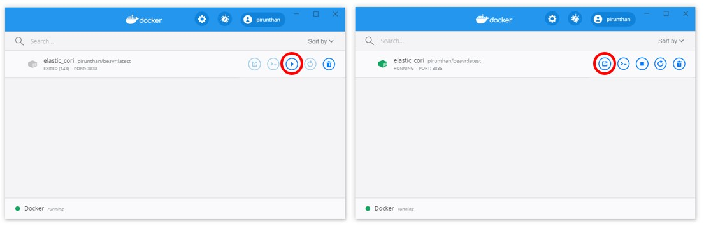

You can use this interface to start, stop, or open a browser to ```localhost:3838``` (circled in red) without using Run-BEAVR.bat or Run-BEAVR.sh executable scripts as explained in step 3 above. 

However, keep in mind that this only runs your current locally downloaded version of BEAVR. To get the most up-to-date version, follow step 3 to update your local copy.

---

### Docker on Mac OS

1. Install Docker from the Docker website using their setup wizard:
	- [Docker Desktop for Mac OS](https://docs.docker.com/docker-for-mac/install)

2. Download and extract the BEAVR-Docker setup package for Mac OS:
	- [Mac OS](https://github.com/developerpiru/BEAVR/raw/master/Docker%20Setup/BEAVR-Docker-Mac.zip)

3. Before you can execute the setup script, you will likely have to allow execute permissions or Mac OS will give you an error. You can do this as follows for both configuration scripts:
	```
	chmod +x ~/Downloads/BEAVR-Docker-Mac/Run-BEAVR.command
	```
	Where ```~/Downloads/``` is the path where you extracted the BEAVR-Docker-Mac folder above (usually your Downloads folder or ```~/Desktop/``` if you moved it to your desktop.)

4. If you double-click **Run-BEAVR.command**, you will likely get another error because you didn't download it from the App store. 

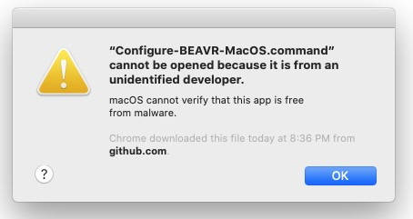

5. To get around this, **right-click** and go to **Open** and then click **Open** in the popup box:
	
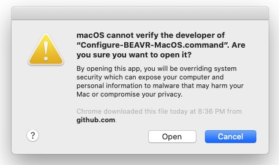
		
6. Open your browser and enter ```localhost:3838``` in the address bar to use BEAVR.

Once the Docker container is downloaded to your computer, you can also access it from the Docker Dashboard  as shown below (to get to the Dashboard, click the Docker whale icon in system tray in the top right of your screen and then click Dashboard):


You can use this interface to start, stop, or open a browser to ```localhost:3838``` (circled in red) without using Run-BEAVR.bat or Run-BEAVR.sh executable scripts as explained in step 3 above. 

However, keep in mind that this only runs your current locally downloaded version of BEAVR. To get the most up-to-date version, follow step 3 to update your local copy.

---

### Docker on Linux (Ubuntu)

1. Download and extract the BEAVR Docker setup package for Linux:
	- [Linux](https://github.com/developerpiru/BEAVR/raw/master/Docker%20Setup/BEAVR-Docker-Linux.tar.gz)
	
2. Install Docker for your operating system:
	Use our automated installer in the BEAVR-Docker-Linux package you extracted above (named **Docker-setup-ubuntu.sh**). You will need to open a terminal and enter this command to execute it:
	```
	bash Docker-setup-ubuntu.sh
	```
		
	Note, if you get permission errors, you may need to give the script executable permission
	```
	chmod +x Docker-setup-ubuntu.sh
	```
		
3. Run (pull) our Docker container:	
	- Enter ```bash Run-BEAVR.sh``` in a terminal.
	
	Note, if you get permission errors, you may need to give the script executable permission
	```
	chmod +x Run-BEAVR.sh
	```

4. Open your browser and enter ```localhost:3838``` in the address bar to use BEAVR.

---

## Setup a new R environment with the automated installer

If you prefer not to install Docker and **you do not already have R installed** on your computer, you can follow these steps to easily install and configure R for BEAVR.

---

### A new R environment in Windows

1. Download and Install R for Windows using the installation wizard:
	- On Windows, download R 3.6.3 [here](https://cloud.r-project.org/bin/windows/base/R-3.6.3-win.exe)

2. Download and extract the BEAVR setup files from [here](https://github.com/developerpiru/BEAVR/raw/master/Releases/1.0.8/BEAVR-v1.0.8-Windows-MacOS.zip)

3. Look in the "Setup" folder to find the automated installer for Windows:
	- Double-click **Configure-BEAVR-Windows.bat** (you may need to right click and run as administrator)

	This will download and install the R packages required for BEAVR.

4. To run BEAVR:
	- Double-click **Run-BEAVR-Windows.bat**
	
---

### A new R environment in Mac OS

1. Download and Install R for your operating system using the installation wizard:
	- Download R 3.6.3 for Catalina [here](https://cloud.r-project.org/bin/macosx/R-3.6.3.pkg)
	- Download R 3.6.3 for El Capitan and higher [here](https://cloud.r-project.org/bin/macosx/R-3.6.3.nn.pkg)

2. Download and extract the BEAVR setup files from [here](https://github.com/developerpiru/BEAVR/raw/master/Releases/1.0.8/BEAVR-v1.0.8-Windows-MacOS.zip)

3. Before you can execute the install scripts, you will likely have to allow execute permissions or Mac OS will give you an error. You can do this as follows for both configuration scripts:
	```
	chmod +x ~/Downloads/BEAVR/Setup/Configure-BEAVR-MacOS.command
	chmod +x ~/Downloads/BEAVR/Run-BEAVR-MacOS.command
	```
	Where ```~/Downloads/``` is the path where you extracted BEAVR above (usually your Downloads folder or ```~/Desktop/``` if you moved it to your desktop.)
	
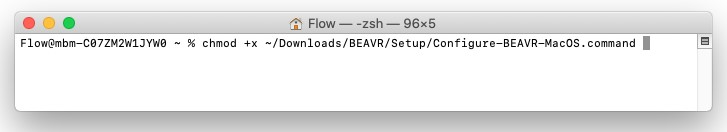
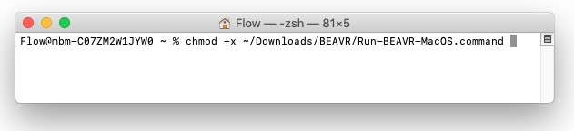
	
4. Look in the "Setup" folder to find the automated installer for Mac OS named **Configure-BEAVR-MacOS.command**. If you double-click the **Configure-BEAVR-MacOS.command** installer, you will likely get another error because you didn't download it from the App store. 


5. To get around this, **right-click** and go to **Open** and then click **Open** in the popup box:
	

	
	This will download and install the R packages required for BEAVR.

6. To run BEAVR:
	- Right-click **Run-BEAVR-MacOS.command**, click **Open** and then click **Open** again in the popup box.

---

### A new R environment in Linux

1. Download and extract the BEAVR setup files for Linux:
	- [Linux](https://github.com/developerpiru/BEAVR/raw/master/Releases/1.0.8/BEAVR-v1.0.8-setup-Linux.tar.gz)
	
2. Run the automated installer (named **Configure-BEAVR-Linux.sh**). You will need to open a terminal and enter this command to execute it:
	```
	bash Configure-BEAVR-Linux.sh
	```
	This will install the latest version of R and also download and configure all of the required R packages for BEAVR automatically.
	
	Note, if you get permission errors, you may need to give the script executable permission
	```
	chmod +x Configure-BEAVR-Linux.sh
	```

3. To run BEAVR, enter this command from a terminal:
	```
	bash Run-BEAVR-Linux.sh
	```
	
	Note, if you get permission errors, you may need to give the script executable permission
	```
	chmod +x Run-BEAVR-Linux.sh
	```

---

## Run in your existing R installation

If you already have a working installation of R on your computer (version 3.5+), then you can follow these steps to install the required R packages to run BEAVR on any operating system.

	Note, the required packages are as follows:
	```
	#CRAN packages
	colourpicker
	data.table
	devtools
	DT
	ggplot2
	ggpubr
	ggrepel
	ggraph
	gridExtra
	pheatmap
	RColorBrewer
	scales
	shiny
	shinydashboard
	shinyWidgets
	shiny
	shinydashboard
	shinyjqui
	shinyWidgets
	shinycssloaders
	circlize

	#Bioconductor packages
	DESeq2
	vsn
	apeglm
	org.Hs.eg.db
	org.Mm.eg.db
	ReactomePA
	enrichplot

	#GitHub packages
	kevinblighe/EnhancedVolcano
	jokergoo/ComplexHeatmap
	```

---

### Use your existing R installation in Windows

1. Download and extract the BEAVR setup files from [here](https://github.com/developerpiru/BEAVR/raw/master/Releases/1.0.8/BEAVR-v1.0.8-Windows-MacOS.zip)

2. Look in the "Setup" folder to find the automated installer for Windows:
	- Double-click **Configure-BEAVR-Windows.bat** (you may need to right click and run as administrator)

	This will download and install the R packages required for BEAVR.

3. To run BEAVR:
	- Double-click **Run-BEAVR-Windows.bat**
	
	or
	
	You can open the **start.R** file in RStudio and click Run App button in the top right
	
	or 
	
	You can run BEAVR from the R command prompt (after changing the working directory to where you extracted BEAVR)
	```
	setwd('\path\to\where\you\extracted\BEAVR\')
	library(shiny)
	library(shinydashboard)
	runApp(port=3838)
	```

---

### Use your existing R installation in Mac OS

1. Download and extract the BEAVR setup files from [here](https://github.com/developerpiru/BEAVR/raw/master/Releases/1.0.8/BEAVR-v1.0.8-Windows-MacOS.zip)

2. Before you can execute the install scripts, you will likely have to allow execute permissions or Mac OS will give you an error. You can do this as follows for both configuration scripts:
	```
	chmod +x ~/Downloads/BEAVR/Setup/Configure-BEAVR-MacOS.command
	chmod +x ~/Downloads/BEAVR/Run-BEAVR-MacOS.command
	```
	Where ```~/Downloads/``` is the path where you extracted BEAVR above (usually your Downloads folder or ```~/Desktop/``` if you moved it to your desktop.)

3. Look in the "Setup" folder to find the automated installer for Mac OS named **Configure-BEAVR-MacOS.command**. If you double-click the **Configure-BEAVR-MacOS.command** installer, you will likely get another error because you didn't download it from the App store. 


4. To get around this, **right-click** and go to **Open** and then click **Open** in the popup box:
	

	
	This will download and install the R packages required for BEAVR.

5. To run BEAVR:
	- Right-click **Run-BEAVR-MacOS.command**, click **Open** and then click **Open** again in the popup box.
	
	or
	
	You can open the **start.R** file in RStudio and click Run App button in the top right
	
	or 
	
	You can run BEAVR from the R command prompt (after changing the working directory to where you extracted BEAVR)
	```
	setwd('\path\to\where\you\extracted\BEAVR\')
	library(shiny)
	library(shinydashboard)
	runApp(port=3838)
	```

---

### Use your existing R installation in Linux

1. Download and extract the BEAVR setup files for Linux:
	- [Linux](https://github.com/developerpiru/BEAVR/raw/master/Releases/1.0.8/BEAVR-v1.0.8-setup-Linux.tar.gz)

2. Run the automated R script file to install all the required packages automatically (or you may install them manually; see the complete list above)
	```
	sudo Rscript installpkgs.R
	```
	
3. To run BEAVR, enter this command from a terminal from the BEAVR folder:
	```
	bash Run-BEAVR-Linux.sh
	```
	
	or
	
	```
	Rsript start.R
	```
	
	Note, if you get permission errors, you may need to give the script executable permission
	```
	chmod +x Run-BEAVR-Linux.sh
	```
	
	or 
	
	You can run BEAVR from the R command prompt (after changing the working directory to where you extracted BEAVR)
	```
	setwd('\path\to\where\you\extracted\BEAVR\')
	library(shiny)
	library(shinydashboard)
	runApp(port=3838)

---

## Installing BEAVR on a server with multi-user support

If you wish to have BEAVR running on a centralized server for your research group, you or your system administrator can follow the instructions below. We implement this using Docker and ShinyProxy which allows each user to be sandboxed in a unique Docker instance. These instructions are provided for Linux/Ubuntu servers (for now)

1. Download and extract the **BEAVR-multiuser-server-setup.tar.gz** setup package from [here](https://github.com/developerpiru/BEAVR/raw/master/BEAVR-multi-server-setup/BEAVR-multiuser-server-setup.tar.gz)
	
	Note, if you get any permission errors running the automated configuration scripts, then do this:
	```
	chmod +x *.sh
	```
	From within the folder where you extracted the files.
	
2. If you already have Docker installed on your Ubuntu server, **skip to step 3**. Otherwise, in the setup package you just downloaded, run the Docker installer by entering this command in a terminal (this will remove any previous version of Docker!):
	```
	bash Docker-setup-ubuntu.sh
	```
	
3. If you already have Java 8 runtime environment installed on your Ubuntu server, **skip to step 4**. Otherwise, in the setup package you just downloaded, run the OpenJDK installer by entering this command in a terminal (you can use another distribution of JDK like Oracle as well):
	```
	bash OpenJDK-setup.sh
	```
	
4. Finally, run the script **ShinyProxy-setup.sh** to configure Docker and setup ShinyProxy:
	```
	bash ShinyProxy-setup.sh
	```
	
5. Configure ShinyProxy settings for user access:
	- If you look in the setup package you downloaded in step 1, you will find a file named **application.yml**
	
		- The bottom part of this file is pre-configured for BEAVR already.
	
		- In the top portion of the file, you will find the configuration line for the port (default 8080) and for user access control:
		- You can keep the default "simple" authentication method and specify user names and passwords in this file (note this file is not encrypted!)
		- You can also LDAP authentication or social authentication
		- You can set this to "none" to have no authentication so anyone with the address can access the server
		- See the [ShinyProxy documentation](https://www.shinyproxy.io/configuration/) for more information regarding authentication

6. To start the ShinyProxy server, enter this command in the terminal:
	```
	java -jar shinyproxy-2.3.0.jar
	```

---

# BEAVR Tutorial

## Input files (and example files)

BEAVR requires two file inputs:

1. [Read count table file](https://github.com/developerpiru/BEAVR#preparing-the-read-count-table-file)
2. [Sample treatment matrix file](https://github.com/developerpiru/BEAVR#preparing-the-sample-treatment-matrix-file)

See the [**Examples**](https://github.com/developerpiru/BEAVR/tree/master/Examples) folder for examples of these two files prepared for the [Sehrawat *et al.* (2018)](https://www.ncbi.nlm.nih.gov/pmc/articles/PMC5939079/) dataset. 

These examples should also be in the BEAVR setup files you downloaded. Otherwise, you can download them from [here](https://github.com/developerpiru/BEAVR/tree/master/Examples) 

---

### Preparing the read count table file

The **read counts table file** contains all the raw reads for all the samples in your experiment in a tab-delimited (.txt) or comma-separated (.csv) file type.

The table must be arranged as follows:
1. The first column must contain ENSEMBL IDs for every gene. The heading name for this column must be ```gene_id```.
2. The next ```n``` columns must contain the raw read counts for each ```n``` samples. Label the heading name for each column with a unique sample/replicate identifier.

Here is what it looks like for the [Sehrawat *et al.* (2018)](https://pubmed.ncbi.nlm.nih.gov/29581250-lsd1-activates-a-lethal-prostate-cancer-gene-network-independently-of-its-demethylase-function/) dataset in Microsoft Excel:


The `gene_id` column contains ENSEMBL IDs for each gene. 
The columns labelled `DMSO_24h-1, DMSO_24h-2, DMSO_24h-3, SP2509_24h-1, SP2509_24h-2, SP2509_24h-3` are the unique samples/replicates in the experiment and contain the raw, unnormalized read quantities for each gene for eacn sample.

---

### Preparing the sample treatment matrix file

The **sample treatment matrix file** informs BEAVR which columns in the read count file belong to which treatment groups (ie. Untreated and Treated, or Wildtype and Mutant). The file type may be tab-delimited (.txt) or comma-separated (.csv).

The table must be arranged as follows:
1. The first column must list the sample or replicate identifiers of each sample you have in your read counts file. For example, for ```n``` samples in the read counts file, you must have ```n``` rows in the column data file. Each row is a unique sample. The heading name for this column can be left blank (it is not used).
	- **Note:** it is critical that the order of the samples here (each row) is in the **same order** as the samples (each column) in the read count table file!
2. The second column identifies which treatment condition/group the samples belong to. The heading name for this column must be ```condition```. For example, in each row of this column, you must identify that respective sample as belonging to ```Untreated``` or ```Treated``` or ```Wildtype``` or ```Mutant```.
3. In the third column, you can specify additional characteristics for each sample. For example, you can specify different genotype groups or replicates like ```Replicate-A```, ```Replicate-B```, and ```Replicate-C``` (must be alphanumeric). The heading name for this column must be ```replicate```.

Here is the sample treatment matrix file prepared for the [Sehrawat *et al.* (2018)](https://pubmed.ncbi.nlm.nih.gov/29581250-lsd1-activates-a-lethal-prostate-cancer-gene-network-independently-of-its-demethylase-function/) dataset in Microsoft Excel:


---

## Loading your data into BEAVR

On the ```Load Data``` tab, select the files you have prepared. Make sure you select the correct file type format for each file. 

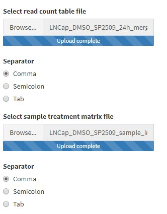

---

## Experiment settings

On the ```Settings``` tab, you can select a few options such as the reference organism, the control condition and the treatment condition, the false discovery rate used for statistics, and the minimum read count required for each gene (genes below this value will be dropped from analysis).

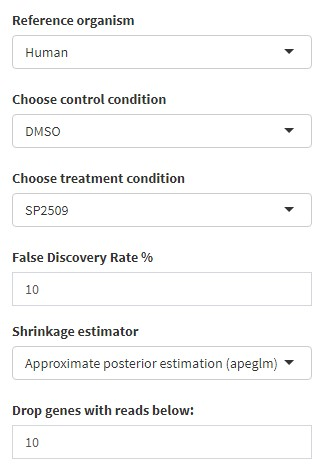

---

## Differential gene expression analysis (DGE)

Click on the ```Gene Table``` tab to begin calculations. You will see a progress bar in the bottom right-hand corner of the window. The results will be displayed in a table format which you can search, order and filter and download using the sidebar. 

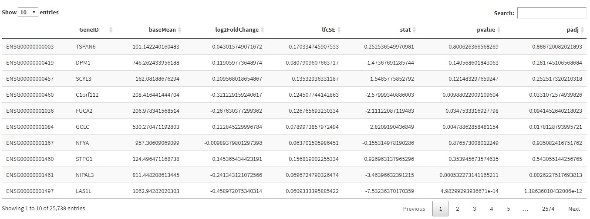

Once these calculations finish, you can begin to visualize your data through a series of figures and download the results.

---

## Plots, graphs and heatmaps

Each of the other tabs will provide output of plots, graphs, heatmaps and pathway figures for your data

---

### PCA plot

The ``PCA`` tab will plot each sample on the same plot and show you the variances between samples. 


---

### Sample clustering plot

The ```Sample Clustering``` tab will cluster samples by rows and columns depending on the variance.


---

### Read count plots

The ```Read Count Plots``` tab will allow you to plot the normalized read counts for any number of genes you specify.


You can enter genes in the sidebar separated by a comma (no spaces, as shown in image). You can specify a grid layout to show multiple plots. For example, specify 2 rows by 2 columns to show 4 plots in a square format. Or you can specify 4 rows by 1 column to show them in a stacked column format. You can also customize the position of the legend or not show a legend at all. To show just a single plot, set the grid to 1x1.

You can also chose to display the read counts in a jitter plot instead of a box plot:


---

### Heatmap

The ```Heatmap``` tab will allow you to display the differential expression of genes in a clustered heatmap. You can enter a list of genes separated by a comma to make a heatmap of genes you are interested in. Alternatively, if you want to make a heatmap of the top differentially expressed genes, select the checkbox ```Show top genes instead``` and then enter the number of top genes to show  (e.g. the top 10, 50, 100, etc.). Note: increasing the number of genes to show will increase processing time to perform clustering.


---

### Volcano plot

The ```Volcano Plot``` tab will plot the differentially expressed genes in a volcano plot format which, unlike the heatmap, will also display the p value information for each gene.


If filtering is enabled in the ```Gene Table``` tab, then only those filtered genes will be used to make the volcano plot. Otherwise, all the genes from the Gene Table will be used.

---

### Pathway Enrichment Plot

The ```Pathway Enrichment Plot``` tab will perform over-representation analysis using the filtered (or unfiltered) data set from the ```Gene Table``` tab. You can set the p value cutoff in the sidebar of the ```Pathway Enrichment Plot``` and also set the numnder of pathways to show.


You can also change an option in the sidebar to display this data as a dot plot instead of a bar plot.

---

### Pathway Enrichment Map

The ```Pathway Enrichment Map``` tab will perform over-representation analysis and show you all of the pathways as an interconnected map.

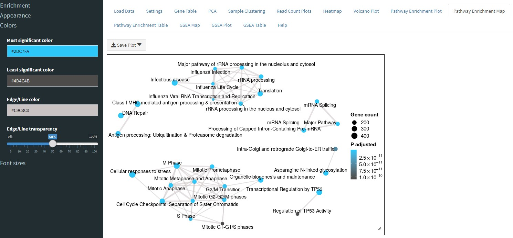

---

### Pathway Enrichment Table

The ```Pathway Enrichment Table``` tab will show you details of the enrichment results from the ```Pathway Enrichment Plot``` tab. You can use the ```Download Table``` button in the sidebar to download the table or use the controls in the sidebar to filter the results.

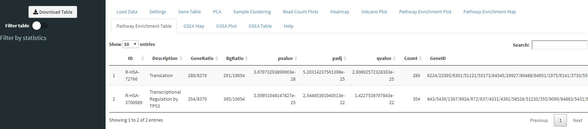

---

### Gene set enrichment analysis (GSEA)

Similar to the ```Pathway Enrichment Map``` tab, the ```GSEA Map``` tab will perform GSEA and show you an interconnected map of pathways.

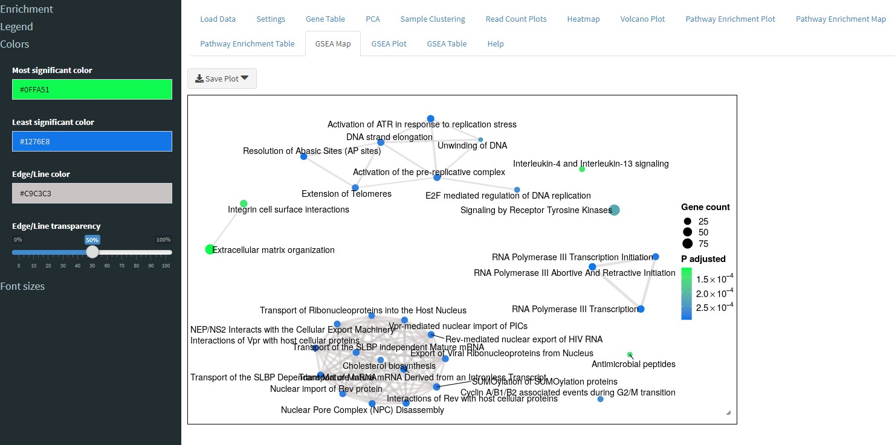

---

### GSEA running enrichment score plot

The ```GSEA plot``` tab, will perform GSEA on your data and plot the running enrichment score. You can select which pathway to plot in the sidebar from a list of enriched pathways.

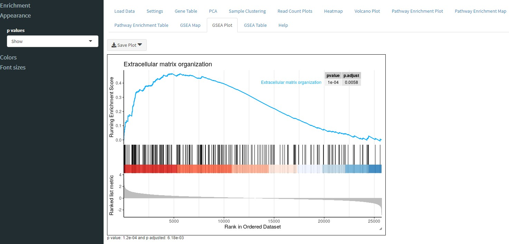

---

### GSEA Table

Similar to the ```Pathway Enrichment Table``` tab, the ```GSEA Table``` tab will show you the results of GSEA in tabular form. You can download the table or filter it using the sidebar controls.

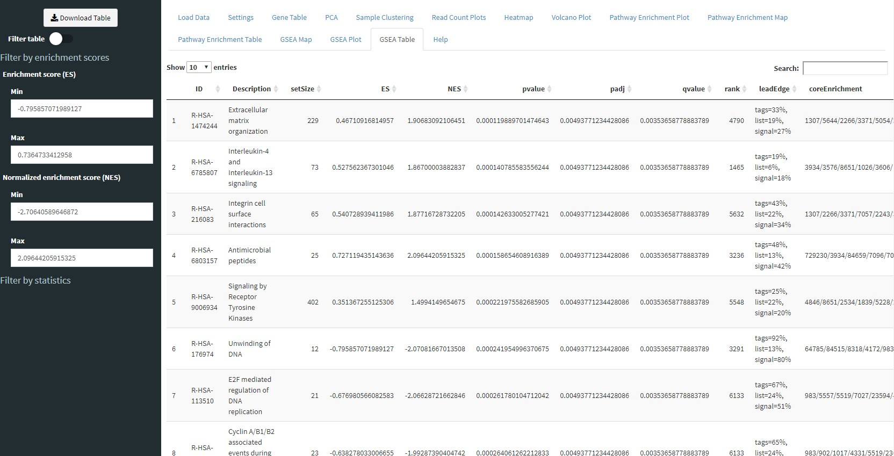

---

## Resizing plots and adjusting the aspect ratio

Any of the figures in BEAVR can be resized to change their size and/or aspect ratio. 

To do this, just put your mouse near the edge of the plots (near the black border). Your mouse pointer will change to indicate the area can be resized. Simply drag with your mouse to resize. 

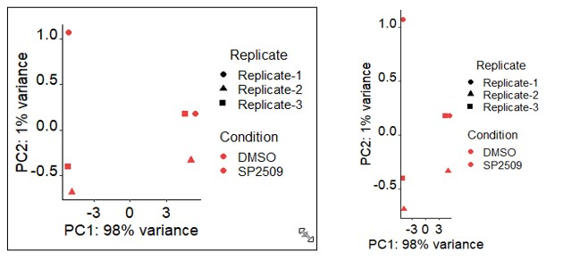

You can hold the Shift key to maintain the same aspect ratio; otherwise you can freely change the aspect ratio.

---

## Saving figures

You can save any figure by using the ```Save Plot``` button above each figure. 

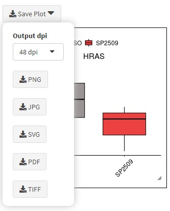

You can save images as JPG, PDF, PNG, SVG, or TIFF. The Output dpi (dots per inch) setting is only used for PDF and SVG formats (the default is 48 dpi).

---

# Troubleshooting

 Issue | Solution
---------|---------
**Bug:** PCA plot, gene read count plot, and volcano plot won't auto-update after changing the treatment condition in experiments with >2 conditions/treatments. The results table will update correctly. | Change one of the parameters in the sidebar for these plots, or just refresh the page, and reload the input files.
**Error message:**```ncol(countData) == nrow(colData) is not TRUE``` | The samples (columns) in your read count table file do not match the samples (rows) in your sample treatment matrix file. Please check to make sure sample names match and that you've selected the correct files (and formats: .csv or .txt) to load into BEAVR.
**Error message:**```None of the keys entered are valid keys for 'ENSEMBL'. Please use the keys method to see a listing of valid arguments``` | This means the ENSEMBL IDs contained in your read count table file cannot be mapped to the reference genome you selected in the Experiment settings tab. Please verify you have selected the correct one.
**Error message:**```mapIds must have at least one key to match against.``` | This error typically occurs when the read count table file is not in the correct format/file type. Please save the file as "CSV (Comma delimited) (.csv)" and not "CSV UTF-8 (Comma delimited) (.csv)".
**Error message:**```unused arguments (pointSize = input$volcanoPointSize, labSize = input$volcanoFontSize_label, legendLabels = c("Not Significant", expression(Log[2] ~ FC ~ only), "p-value only", expression(p - value ~ and ~ log[2] ~ FC)), labCol = "black")``` | This error occurs because you have the incorrect version of the ```EnhancedVolcano``` plot installed and BEAVR is loading that one instead of the correct developmental version of the package. To fix this, remove the EnhancedVolcano package by entering this in R: ```remove.packages("EnhancedVolcano")```, restart your R session. Then install the correct version of the package with: ```devtools::install_github("kevinblighe/EnhancedVolcano")```. If you don't have the ```devtools``` package, then install it with ```install.packages("devtools")```.
