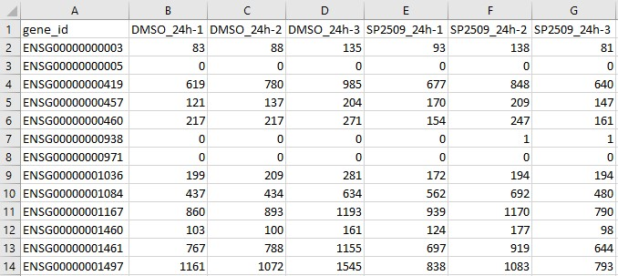
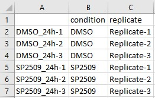
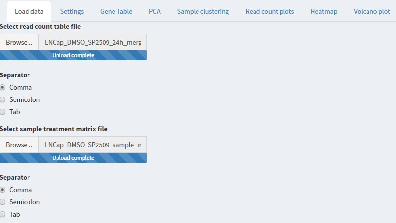
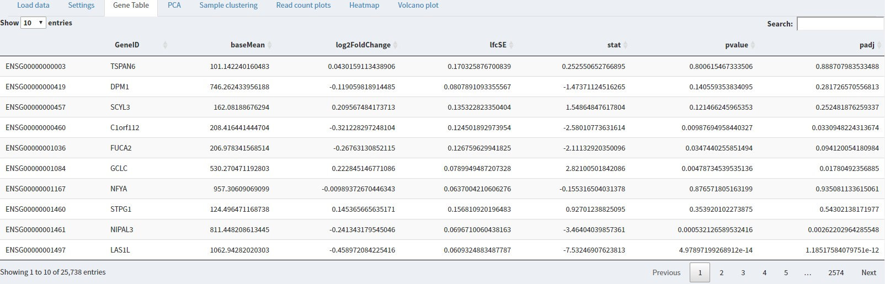
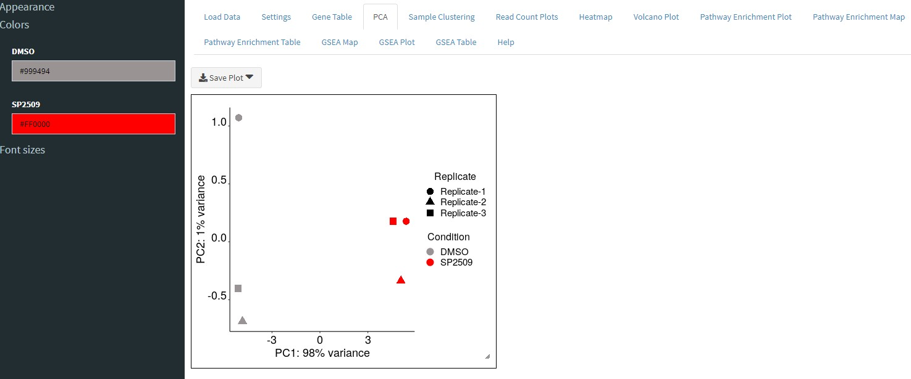
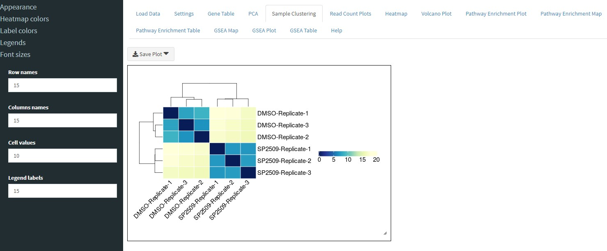
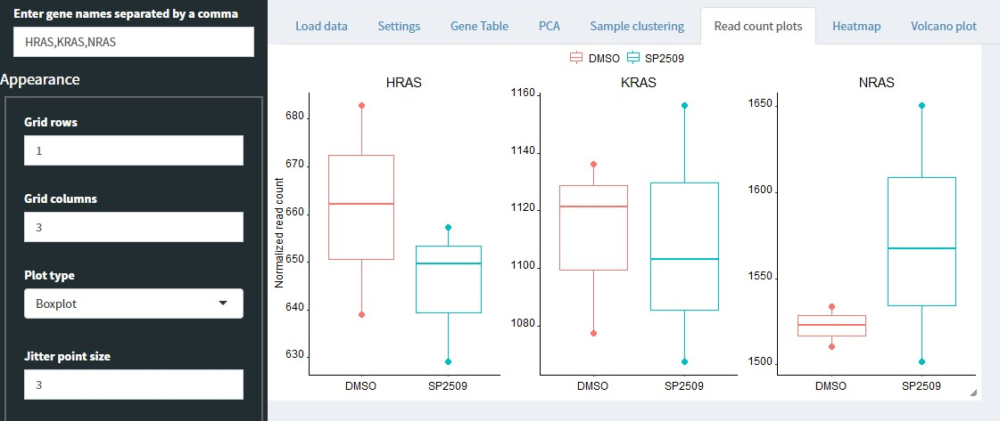
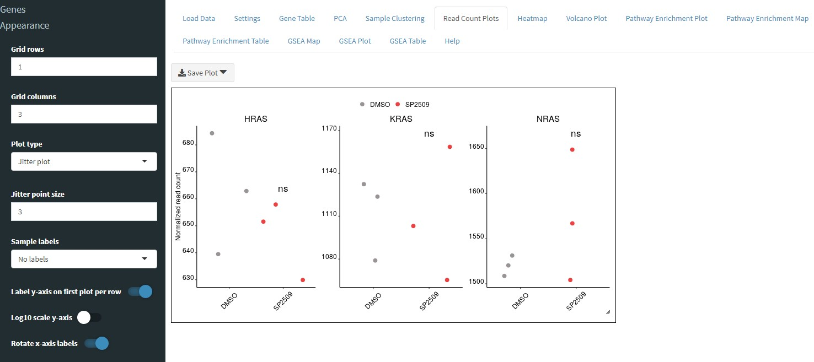
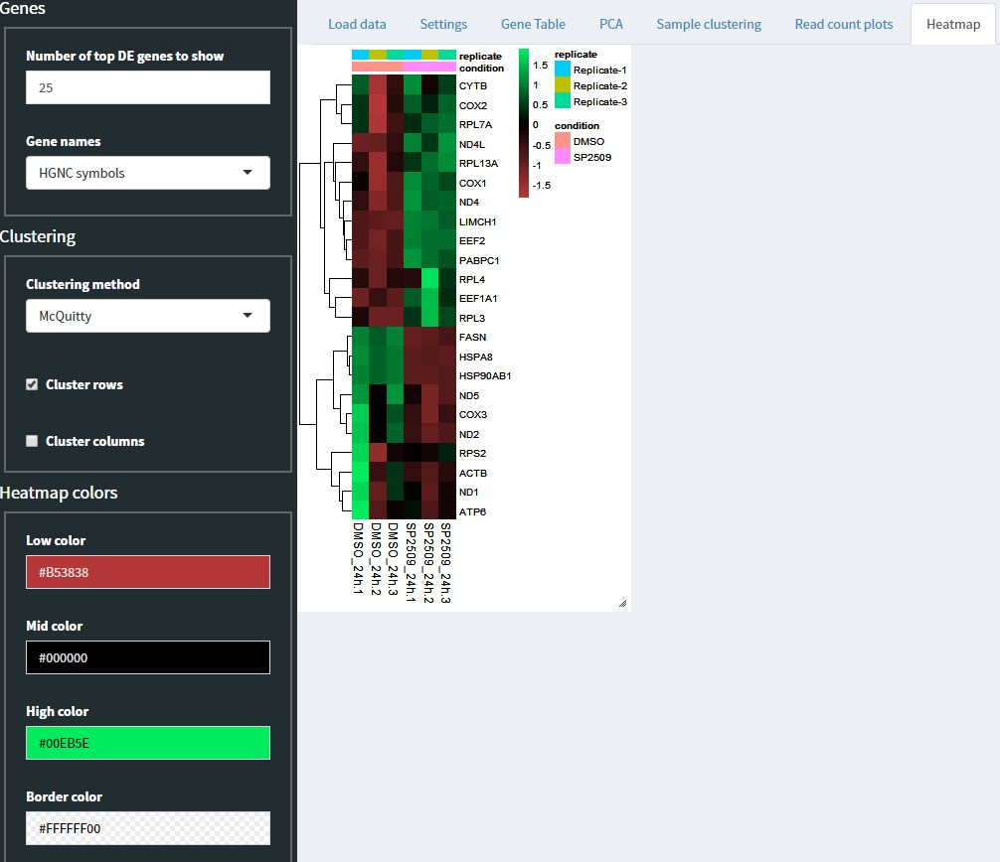

# BEAVR

BEAVR: A **B**rowser-based tool for the **E**xploration **A**nd **V**isualization of **R**NAseq data. 

BEAVR is a graphical tool to automate analysis and exploration of small and large RNAseq datasets using DESeq2.

## Table of contents

[Installation & Requirements](https://github.com/developerpiru/BEAVR#installation--requirements)

[Run BEAVR](https://github.com/developerpiru/BEAVR#run-beavr)

[Usage](https://github.com/developerpiru/BEAVR#usage)

- [Preparing the read count table file](https://github.com/developerpiru/BEAVR#preparing-the-read-count-table-file)
- [Preparing the sample treatment matrix file](https://github.com/developerpiru/BEAVR#preparing-the-sample-treatment-matrix-file)
- [Loading your data into BEAVR](https://github.com/developerpiru/BEAVR#loading-your-data-into-beavr)
- [Experiment settings](https://github.com/developerpiru/BEAVR#experiment-settings)
- [Differential gene expression (DGE) analysis](https://github.com/developerpiru/BEAVR#differential-gene-expression-analysis-dge)
- [Plots, graphs and heatmaps](https://github.com/developerpiru/BEAVR#plots-graphs-and-heatmaps)
  - [PCA plot](https://github.com/developerpiru/BEAVR#pca-plot)
  - [Sample clustering plot](https://github.com/developerpiru/BEAVR#sample-clustering-plot)
  - [Read count plot](https://github.com/developerpiru/BEAVR#read-count-plots)
  - [Heatmap](https://github.com/developerpiru/BEAVR#heatmap)
  - [Volcano plot](https://github.com/developerpiru/BEAVR#volcano-plot)
  - [Resizing and saving images](https://github.com/developerpiru/BEAVR#resizing-and-saving-images)
  
[Known bugs & error messages](https://github.com/developerpiru/BEAVR#known-bugs--error-messages)

## Installation & Requirements

You must have the following components installed in order to run BEAVR:
- R 3.5+	
- library("BiocManager")
- library("shiny")
- library("shinydashboard")

To install the required packages, enter these commands in R:

```
install.packages("BiocManager")
install.packages("shiny")
install.packages("shinydashboard")
```

As of version 0.62, all other required packages will be installed automatically. If you run into an error, make sure you have R 3.5+ installed and try reinstalling the above packages. 

## Run BEAVR

There are two ways to run BEAVR

1. Automatically download and run the latest version directly from GitHub:

Open a new R session and enter these commands:
```
library(shiny)
library(shinydashboard)
runGitHub("BEAVR", "developerpiru")
```

2. Download a local copy and launch from a folder
  1. First download the latest release using the download button above. 
  2. Extract the zip archive
  3. Open a new R session and enter these commands:
	```
	library(shiny)
	library(shinydashboard)
	runApp("/path/to/folder/BEAVR-master")
	```
	Where ```/path/to/folder/``` is the directory where you extracted the zip archive.

If you are using R, a browser window should open automatically showing the app. If you are using RStudio, click "Open in browser" at the top of the popup window.

# Usage

BEAVR requires two file inputs:
1. [Read count table file](https://github.com/developerpiru/BEAVR#preparing-the-read-count-table-file)
2. [Sample treatment matrix file](https://github.com/developerpiru/BEAVR#preparing-the-sample-treatment-matrix-file)

See the [**Examples**](https://github.com/developerpiru/BEAVR/tree/master/Examples) folder for examples of these two files prepared for the [Sehrawat *et al.* (2018)](https://pubmed.ncbi.nlm.nih.gov/29581250-lsd1-activates-a-lethal-prostate-cancer-gene-network-independently-of-its-demethylase-function/) dataset. 

## Preparing the read count table file

The **read counts table file** contains all the raw reads for all the samples in your experiment in a tab-delimited (.txt) or comma-separated (.csv) file type.

The table must be arranged as follows:
1. The first column must contain ENSEMBL IDs for every gene. The heading name for this column must be ```gene_id```.
2. The next ```n``` columns must contain the raw read counts for each ```n``` samples. Label the heading name for each column with a unique sample/replicate identifier.

Here is what it looks like for the [Sehrawat *et al.* (2018)](https://pubmed.ncbi.nlm.nih.gov/29581250-lsd1-activates-a-lethal-prostate-cancer-gene-network-independently-of-its-demethylase-function/) dataset in Microsoft Excel:


The `gene_id` column contains ENSEMBL IDs for each gene. 
The columns labelled `DMSO_24h-1, DMSO_24h-2, DMSO_24h-3, SP2509_24h-1, SP2509_24h-2, SP2509_24h-3` are the unique samples/replicates in the experiment and contain the raw, unnormalized read quantities for each gene for eacn sample.

## Preparing the sample treatment matrix file

The **sample treatment matrix file** informs BEAVR which columns in the read count file belong to which treatment groups (ie. Untreated and Treated, or Wildtype and Mutant). The file type may be tab-delimited (.txt) or comma-separated (.csv).

The table must be arranged as follows:
1. The first column must list the sample or replicate identifiers of each sample you have in your read counts file. For example, for ```n``` samples in the read counts file, you must have ```n``` rows in the column data file. Each row is a unique sample. The heading name for this column can be left blank (it is not used).
	- **Note:** it is critical that the order of the samples here (each row) is in the **same order** as the samples (each column) in the read count table file!
2. The second column identifies which treatment condition/group the samples belong to. The heading name for this column must be ```condition```. For example, in each row of this column, you must identify that respective sample as belonging to ```Untreated``` or ```Treated``` or ```Wildtype``` or ```Mutant```.
3. In the third column, you can specify additional characteristics for each sample. For example, you can specify different genotype groups or replicates like ```Replicate-A```, ```Replicate-B```, and ```Replicate-C``` (must be alphanumeric). The heading name for this column must be ```replicate```.

Here is the sample treatment matrix file prepared for the [Sehrawat *et al.* (2018)](https://pubmed.ncbi.nlm.nih.gov/29581250-lsd1-activates-a-lethal-prostate-cancer-gene-network-independently-of-its-demethylase-function/) dataset in Microsoft Excel:


## Loading your data into BEAVR

On the ```Load data``` tab, select the files you have prepared. Make sure you select the correct file type format for each file. 



## Experiment settings

On the ```Settings``` tab, you can select the reference organism, the control condition and the treatment condition, the false discovery rate used for statistics, and the minimum read count required for each gene (genes below this value will be dropped from analysis).

## Differential gene expression analysis (DGE)

Click on the ```Gene Table``` tab to begin calculations. You will see a progress bar in the bottom right-hand corner of the window. The results will be displayed in a table format which you can search, order and filter and download using the sidebar. 




PCA plot, sample clustering/correlation plot, read count plots, heatmap, and volcano plot for your experiment. All graphs and plots can be saved by right clicking on the image and saving as an image.

## Plots, graphs and heatmaps

Each of the other tabs will provide output of plots, graphs, and heatmaps for the data you provided.

### PCA plot

The ``PCA`` tab will plot each sample on the same plot and show you the variances between samples. 



You can customize the plot using the sidebar controls.

### Sample clustering plot

The ```Sample clustering``` tab will cluster samples by rows and columns depending on the variance.



You can customize the plot using the sidebar controls, including the distance measurement method used. For example, selecting Pearson will produce a Pearson correlation plot.

### Read count plots

The ```Read count plots``` tab will allow you to plot the normalized read counts for any number of genes you specify.



You can enter genes in the sidebar separated by a comma (no spaces, as shown in image). You can specify a grid layout to show multiple plots. For example, specify 2 rows by 2 columns to show 4 plots in a square format. Or you can specify 4 rows by 1 column to show them in a stacked column format. You can also customize the position of the legend or not show a legend at all.

You can also chose to display the read counts in a jitter plot instead of a box plot:



### Heatmap

The ```Heatmap``` tab will allow you display the differential expression of genes in a clustered heatmap. You can use the sidebar controls to specify the type of clustering for rows and/or columns and also customize things like the color and font sizes.



### Volcano plot

The ```Volcano plot``` tab will plot the differentially expressed genes in a volcano plot format which, unlike the heatmap, will also display the p value information for each gene. You can use the sidebar controls to specify the cutoffs for the log2 fold change (LFC) and the p value - this is to color the points that meet these cutoffs.


If filtering is enabled in the ```Gene Table``` plot, then only those filtered genes will be used to make the volcano plot. Otherwise, all the genes from the Gene Table will be used.

### Resizing and saving images

Any of the plots, graphs, and heatmaps can be resized by clicking and dragging the edges. 
You can save them by right clicking and choosing "save image as".

# Known bugs & error messages

 Issue | Solution
---------|---------
**Bug:** PCA plot, gene read count plot, and volcano plot won't auto-update after changing the treatment condition. The results table will update correctly. | Edit the parameters in the sidebar for PCA/read count/volcano plots or refresh the page.
**Error message:**```ncol(countData) == nrow(colData) is not TRUE``` | The samples (columns) in your read count table file do not match the samples (rows) in your sample treatment matrix file. Please check to make sure sample names match and that you've selected the correct files (and formats: .csv or .txt) to load into BEAVR.
**Error message:**```None of the keys entered are valid keys for 'ENSEMBL'. Please use the keys method to see a listing of valid arguments``` | This means the ENSEMBL IDs contained in your read count table file cannot be mapped to the reference genome you selected in the Experiment settings tab. Please verify you have selected the correct one.
**Error message:**```mapIds must have at least one key to match against.``` | This error typically occurs when the read count table file is not in the correct format/file type. Please save the file as "CSV (Comma delimited) (.csv)" and not "CSV UTF-8 (Comma delimited) (.csv)".


